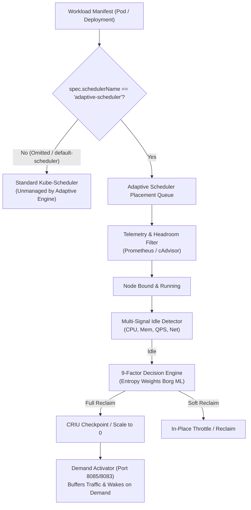
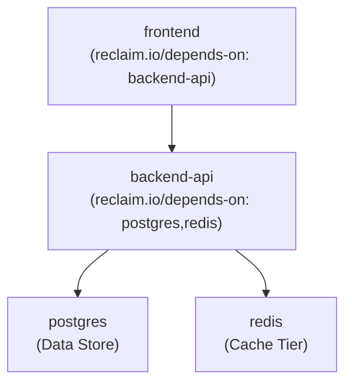

# Adaptive Kubernetes Scheduler: AI Agent & Workload Configuration Guide

> **Audience**: AI Coding Agents, Kubernetes Engineers, and System Architects.  
> **Purpose**: Definitive technical specification and reference manual for writing, generating, and auditing Kubernetes workload manifests that utilize the **Adaptive Kubernetes Scheduler (`adaptive-scheduler`)** and its **Reclamation & Scale-from-Zero Engine**.

---

## 1. System Architecture & Operating Principles

The **Adaptive Kubernetes Scheduler** is an autonomous secondary scheduler and resource optimization controller running in the `kube-system` namespace. It provides:
1. **Dynamic Real-Load Bin Packing**: Places pending pods onto nodes based on physical resource telemetry scraped from Prometheus/cAdvisor rather than static requests.
2. **Autonomous Multi-Signal Idle Detection**: Monitors running workloads across CPU, memory, HTTP QPS, and network bandwidth over sliding sample windows.
3. **Entropy-Weighted Reclamation Engine**: Evaluates idle workloads against machine-learning-derived scoring weights to perform **Soft Reclaim** (resource throttling) or **Full Reclaim** (CRIU process checkpointing / zero-scaling).
4. **Demand Activator & Scale-from-Zero Buffer**: Intercepts HTTP traffic targeting suspended workloads, holds requests in a buffer, reconstitutes pods in topological dependency order (`reclaim.io/depends-on`), and forwards buffered traffic seamlessly once ready.

### The Scheduler Targeting Contract
Kubernetes default schedulers operate strictly on opt-in isolation:
* Standard workloads omit `spec.schedulerName` and are managed by the cluster's `default-scheduler`.
* **Only pods that explicitly declare `spec.schedulerName: adaptive-scheduler` are discovered, placed, telemetry-monitored, and managed by the Adaptive Scheduler.**
* Workloads using `default-scheduler` are completely ignored by the adaptive reclamation engine to ensure cluster safety.



---

## 2. Core Specification Requirements

Every pod or deployment template targeting `adaptive-scheduler` must fulfill two non-negotiable rules:

### A. `spec.schedulerName: adaptive-scheduler` (Mandatory)
Must be defined on the `PodSpec` level:
* In a raw `Pod`: at `spec.schedulerName`
* In a `Deployment` or `StatefulSet`: at `spec.template.spec.schedulerName`

### B. Precise Resource Requests and Limits (Mandatory)
Both CPU and Memory `requests` and `limits` must be specified for every container in the pod:
```yaml
resources:
  requests:
    cpu: "50m"
    memory: "64Mi"
  limits:
    cpu: "200m"
    memory: "128Mi"
```
**Why requests are strictly required:**
1. **Mathematical Headroom Calculation**: The BinPack Scorer and Headroom Filter evaluate real physical allocatable capacity against declared requests:
   $$\text{Headroom}_{\text{Node}} = \text{Allocatable} - \text{ActualUsage} - (\text{Requested} \times 1.05)$$
2. **Telemetry Utilization Denominator**: The Analyzer calculates utilization as:
   $$U_{\text{CPU}} = \frac{\text{Actual Usage Millicores}}{\text{Requested Millicores}}, \quad U_{\text{Memory}} = \frac{\text{Working Set Bytes}}{\text{Requested Bytes}}$$
   If requests are omitted, Kubernetes marks the pod as `BestEffort` (`UtilizationUnavailable`), forcing the scheduler to assign a neutral $0.5$ fallback score, degrading optimization accuracy.

---

## 3. Reclamation Annotations Reference (`reclaim.io/*`)

Annotations control how the Decision Engine and Demand Activator treat the workload during idle periods and wake-up cycles.

| Annotation Key | Value Type | Default | Description |
| :--- | :--- | :--- | :--- |
| **`reclaim.io/checkpointable`** | `"true"` \| `"false"` | Absent (`0.5`) | Indicates whether the container process supports CRIU live memory checkpointing and process freezing. Set to `"true"` for stateless workers or batch processors. Set to `"false"` to block full eviction while permitting soft throttling. |
| **`reclaim.io/protected`** | `"true"` \| `"false"` | `"false"` | **Hard Safety Gate.** When `"true"`, completely exempts the pod from all reclamation (both soft and full), regardless of idle duration or score. Essential for persistent databases and consensus nodes. |
| **`reclaim.io/graceful-redeploy`** | `"true"` \| `"false"` | `"false"` | Instructs the controller to perform graceful replica suspension (scaling deployment replicas to 0) rather than abrupt pod eviction. |
| **`reclaim.io/depends-on`** | Comma-separated list | `""` | **Topological DAG Dependency Chain.** Names of upstream services that must be active before this service can be restored or receive traffic (e.g. `"postgres,redis"`). |
| **`reclaim.io/app`** | String identifier | `""` | Logical application or namespace domain (e.g. `"ecommerce"`). Used for dependency grouping and bulk coordination. |

---

## 4. Priority Labels & Priority Classes

### Priority Classes
The Decision Engine enforces a safety ceiling based on numeric priority:
* Any pod with numeric `Priority >= 100000` (such as `system-cluster-critical` or `system-node-critical`) is **automatically blocked from reclamation**.
* User workloads should use standard default priorities (`0`) or lower.

### Reclaim Class Labels
To categorize service tier and scheduling priority, apply the `scheduler.reclaim/class` label:
* **`scheduler.reclaim/class: "A"`**: High-priority user-facing microservice.
* **`scheduler.reclaim/class: "B"`**: Standard stateless backend service.
* **`scheduler.reclaim/class: "C"`**: Background batch job / asynchronous worker (reclaim candidate).

---

## 5. Topological Dependency DAG (`reclaim.io/depends-on`)

When multiple microservices are reclaimed and scaled to zero, an incoming request to a frontend or API service triggers a cascade. The **Demand Activator** constructs a Directed Acyclic Graph (DAG) using `reclaim.io/depends-on` to ensure dependencies wake up in the correct order:



**Restoration Execution Order:**
1. Demand Activator pauses the incoming HTTP request.
2. Activator inspects DAG: `frontend` depends on `backend-api`, which depends on `postgres` and `redis`.
3. Activator wakes `postgres` and `redis` first.
4. Once database readiness probes return `200 OK`, Activator wakes `backend-api`.
5. Once `backend-api` readiness probe passes, `frontend` processes the buffered HTTP request.

---

## 6. Workload Manifest Archetypes (Copy-Paste Templates)

### Archetype 1: Stateless Web Service / REST API (e.g., Node.js, Go, Python)
* Multi-replica deployment with dependency tracking, graceful scaling, and readiness probes.

```yaml
apiVersion: apps/v1
kind: Deployment
metadata:
  name: order-service
  namespace: production
  labels:
    app: order-service
    scheduler.reclaim/class: "B"
  annotations:
    reclaim.io/app: "ecommerce"
    reclaim.io/checkpointable: "true"
    reclaim.io/graceful-redeploy: "true"
    reclaim.io/depends-on: "postgres-db,redis-cache"
spec:
  replicas: 2
  selector:
    matchLabels:
      app: order-service
  template:
    metadata:
      labels:
        app: order-service
        scheduler.reclaim/class: "B"
      annotations:
        reclaim.io/app: "ecommerce"
        reclaim.io/checkpointable: "true"
        reclaim.io/graceful-redeploy: "true"
        reclaim.io/depends-on: "postgres-db,redis-cache"
    spec:
      schedulerName: adaptive-scheduler
      terminationGracePeriodSeconds: 30
      containers:
        - name: app
          image: myregistry.internal/order-service:v1.2.0
          imagePullPolicy: IfNotPresent
          ports:
            - containerPort: 8080
              name: http
          resources:
            requests:
              cpu: "100m"
              memory: "128Mi"
            limits:
              cpu: "500m"
              memory: "256Mi"
          readinessProbe:
            httpGet:
              path: /healthz
              port: 8080
            initialDelaySeconds: 5
            periodSeconds: 5
            timeoutSeconds: 3
          livenessProbe:
            httpGet:
              path: /healthz
              port: 8080
            initialDelaySeconds: 15
            periodSeconds: 10
---
apiVersion: v1
kind: Service
metadata:
  name: order-service
  namespace: production
  labels:
    app: order-service
spec:
  type: ClusterIP
  ports:
    - port: 8080
      targetPort: 8080
      protocol: TCP
      name: http
  selector:
    app: order-service
```

---

### Archetype 2: Checkpointable Asynchronous Worker / Batch Processor
* Heavy memory or computation background processor. When idle, eligible for full CRIU memory checkpointing.

```yaml
apiVersion: apps/v1
kind: Deployment
metadata:
  name: image-resizer-worker
  namespace: production
  labels:
    app: image-resizer-worker
    scheduler.reclaim/class: "C"
  annotations:
    reclaim.io/app: "media-pipeline"
    reclaim.io/checkpointable: "true"
    reclaim.io/graceful-redeploy: "true"
    reclaim.io/depends-on: "redis-queue"
spec:
  replicas: 1
  selector:
    matchLabels:
      app: image-resizer-worker
  template:
    metadata:
      labels:
        app: image-resizer-worker
        scheduler.reclaim/class: "C"
      annotations:
        reclaim.io/app: "media-pipeline"
        reclaim.io/checkpointable: "true"
        reclaim.io/graceful-redeploy: "true"
        reclaim.io/depends-on: "redis-queue"
    spec:
      schedulerName: adaptive-scheduler
      containers:
        - name: worker
          image: myregistry.internal/image-resizer:latest
          resources:
            requests:
              cpu: "250m"
              memory: "256Mi"
            limits:
              cpu: "1000m"
              memory: "512Mi"
          env:
            - name: QUEUE_HOST
              value: "redis-queue"
            - name: QUEUE_PORT
              value: "6379"
```

---

### Archetype 3: Stateful Storage Tier (Protected Database / Cache)
* StatefulSet with persistent volume. Must be explicitly protected from eviction or checkpoint suspension.

```yaml
apiVersion: apps/v1
kind: StatefulSet
metadata:
  name: postgres-db
  namespace: production
  labels:
    app: postgres-db
    scheduler.reclaim/class: "A"
  annotations:
    reclaim.io/app: "ecommerce"
    reclaim.io/protected: "true"
    reclaim.io/checkpointable: "false"
spec:
  serviceName: postgres-db
  replicas: 1
  selector:
    matchLabels:
      app: postgres-db
  template:
    metadata:
      labels:
        app: postgres-db
        scheduler.reclaim/class: "A"
      annotations:
        reclaim.io/app: "ecommerce"
        reclaim.io/protected: "true"
        reclaim.io/checkpointable: "false"
    spec:
      schedulerName: adaptive-scheduler
      containers:
        - name: postgres
          image: postgres:15-alpine
          ports:
            - containerPort: 5432
              name: postgres
          env:
            - name: POSTGRES_DB
              value: "ecommerce"
            - name: POSTGRES_USER
              value: "postgres"
            - name: POSTGRES_PASSWORD
              valueFrom:
                secretKeyRef:
                  name: db-credentials
                  key: password
          resources:
            requests:
              cpu: "100m"
              memory: "256Mi"
            limits:
              cpu: "500m"
              memory: "512Mi"
          volumeMounts:
            - name: pgdata
              mountPath: /var/lib/postgresql/data
  volumeClaimTemplates:
    - metadata:
        name: pgdata
      spec:
        accessModes: ["ReadWriteOnce"]
        resources:
          requests:
            storage: 10Gi
```

---

### Archetype 4: Reverse Proxy / Ingress with Activator Scale-from-Zero Fallback
* When an upstream microservice is scaled to zero by the scheduler, the proxy fails over to the Demand Activator (`adaptive-scheduler.kube-system.svc.cluster.local:8083`), which buffers the request and restores the service.

```nginx
# Nginx Configuration Snippet for Scale-from-Zero Buffer
upstream backend_service {
    server backend-api.production.svc.cluster.local:8080 max_fails=1 fail_timeout=5s;
    # Demand Activator Buffer fallback
    server adaptive-scheduler.kube-system.svc.cluster.local:8083 backup;
}

server {
    listen 80;
    location /api/ {
        proxy_pass http://backend_service;
        proxy_connect_timeout 2s;
        proxy_read_timeout 60s;
        proxy_next_upstream error timeout http_502 http_503 http_504;
        proxy_set_header X-Target-Service "backend-api";
        proxy_set_header X-Target-Namespace "production";
    }
}
```

---

## 7. AI Agent Manifest Generation Checklist

When writing or modifying Kubernetes YAML manifests for workloads using the Adaptive Scheduler, verify each item in this checklist:

| Verification Check | Pass Condition | Rationale |
| :--- | :--- | :--- |
| **1. Scheduler Field** | `spec.schedulerName: adaptive-scheduler` | Essential. Omission causes silent scheduling by `default-scheduler`. |
| **2. CPU Sizing** | Explicit `resources.requests.cpu` and `limits.cpu` | Required for headroom filter and utilization denominator. |
| **3. Memory Sizing** | Explicit `resources.requests.memory` and `limits.memory` | Required for OOM avoidance and working set metrics. |
| **4. Checkpoint Annotation** | `reclaim.io/checkpointable: "true"` or `"false"` | Determines if CRIU memory checkpointing is permitted. |
| **5. Protection Flag** | `reclaim.io/protected: "true"` on databases/stateful sets | Prevents accidental suspension of persistent datastores. |
| **6. Dependency Ordering** | `reclaim.io/depends-on` declares upstream prerequisites | Prevents 502/connection refused errors during scale-from-zero wakeups. |
| **7. Probes** | `readinessProbe` and `livenessProbe` defined | Demand Activator monitors readiness probes before releasing buffered requests. |
| **8. Graceful Teardown** | `terminationGracePeriodSeconds >= 30` | Ensures process has time to flush open writes or complete checkpoint dumps. |
