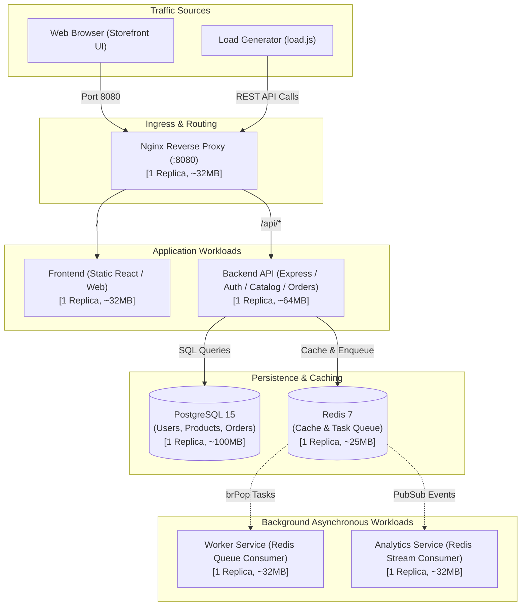

# Kubernetes & Kind Deployment Guide

This guide provides step-by-step instructions to build, load, and deploy the streamlined **Cloud E-Commerce** platform in a local Kubernetes cluster using **Kind** (Kubernetes in Docker).

The architecture is optimized to run efficiently with a minimal memory footprint (< 500 MB RAM for the application), fitting comfortably on a development machine with **10 GB of RAM**.

---

## Architecture Overview



---

## Prerequisites

Ensure you have the following installed on your machine:
1. **Docker Desktop** (or Docker Engine in WSL2)
2. **Kind CLI** ([Installation Guide](https://kind.sigs.k8s.k8s.io/docs/user/quick-start/))
3. **Kubectl CLI** ([Installation Guide](https://kubernetes.io/docs/tasks/tools/))
4. **Node.js 18+** (for running the load generator script locally)

### WSL2 (Ubuntu / Linux) Docker, Kubectl & Kind Setup

If you are using WSL2 on Windows, execute these steps inside your bash terminal:

#### 0. Configure WSL for Kubernetes (Cgroup v2 & Systemd)
Newer Kubernetes control planes (and Kind) require **cgroup v2** and **systemd**:
```bash
# 1. Enable systemd in WSL
if [ ! -f /etc/wsl.conf ] || ! grep -q "systemd=true" /etc/wsl.conf; then
  echo -e "[boot]\nsystemd=true" | sudo tee -a /etc/wsl.conf
fi

# 2. Configure Windows host to force cgroup v2 unified hierarchy
powershell.exe -Command 'Set-Content -Path "$env:USERPROFILE\.wslconfig" -Value "[wsl2]`nkernelCommandLine = cgroup_no_v1=all systemd.unified_cgroup_hierarchy=1"'

# 3. Shutdown WSL to apply changes (reopen terminal after running)
powershell.exe -Command 'wsl --shutdown'
```

#### 1. Setup Docker
- **Docker Desktop (Recommended):** Enable **Use the WSL 2 based engine** and toggle **WSL Integration** for your distribution in Docker Desktop Settings.
- **Native Docker Engine:**
  ```bash
  sudo apt-get update && sudo apt-get install -y ca-certificates curl gnupg
  sudo install -m 0755 -d /etc/apt/keyrings
  curl -fsSL https://download.docker.com/linux/ubuntu/gpg | sudo gpg --dearmor -o /etc/apt/keyrings/docker.gpg
  sudo chmod a+r /etc/apt/keyrings/docker.gpg
  echo "deb [arch=$(dpkg --print-architecture) signed-by=/etc/apt/keyrings/docker.gpg] https://download.docker.com/linux/ubuntu $(. /etc/os-release && echo "$VERSION_CODENAME") stable" | sudo tee /etc/apt/sources.list.d/docker.list > /dev/null
  sudo apt-get update && sudo apt-get install -y docker-ce docker-ce-cli containerd.io docker-buildx-plugin docker-compose-plugin
  sudo service docker start
  sudo usermod -aG docker $USER
  ```

#### 2. Install `kubectl`
```bash
curl -LO "https://dl.k8s.io/release/$(curl -L -s https://dl.k8s.io/release/stable.txt)/bin/linux/amd64/kubectl"
chmod +x ./kubectl
sudo mv ./kubectl /usr/local/bin/kubectl
kubectl version --client
```

#### 3. Install `kind`
```bash
curl -Lo ./kind https://kind.sigs.k8s.io/dl/v0.32.0/kind-linux-amd64
chmod +x ./kind
sudo mv ./kind /usr/local/bin/kind
kind --version
```

---

## Step 1: Create a Kind Cluster with a Multi-Node Topology

We create a 2-node cluster (1 control plane, 1 worker node) to properly test scheduling pressure and node-level placement:

1. Create a configuration file named `kind-config.yaml`:
   ```bash
   cat <<EOF > kind-config.yaml
   apiVersion: kind.x-k8s.io/v1alpha4
   kind: Cluster
   nodes:
     - role: control-plane
     - role: worker
   EOF
   ```
2. Spin up the cluster:
   ```bash
   kind create cluster --config kind-config.yaml
   ```
3. Verify your nodes are active:
   ```bash
   kubectl get nodes
   ```

---

## Step 2: Install Kubernetes Metrics Server

The **Metrics Server** collects real-time CPU and memory usage across pods and nodes, enabling idle detection for adaptive scheduling.

1. Apply the official Metrics Server manifest:
   ```bash
   kubectl apply -f https://github.com/kubernetes-sigs/metrics-server/releases/latest/download/components.yaml
   ```
2. Patch Metrics Server for Kind's self-signed certificates:
   ```bash
   kubectl patch deployment metrics-server -n kube-system --type='json' -p='[{"op": "add", "path": "/spec/template/spec/containers/0/args/-", "value": "--kubelet-insecure-tls"}]'
   ```
3. Verify the Metrics Server is running:
   ```bash
   kubectl get deployment metrics-server -n kube-system
   ```

---

## Step 3: Build & Load Docker Images

Build the streamlined container images locally and load them directly into the Kind cluster nodes:

1. Navigate to the `cloud-ecommerce` directory:
   ```bash
   cd cloud-ecommerce
   ```
2. Build the Docker images:
   ```bash
   docker build -t frontend:latest ./frontend
   docker build -t nginx-custom:latest ./nginx
   docker build -t backend-api:latest ./backend-api
   docker build -t worker:latest ./worker
   docker build -t analytics-service:latest ./analytics-service
   ```
3. Load the images into the Kind cluster:
   ```bash
   kind load docker-image frontend:latest
   kind load docker-image nginx-custom:latest
   kind load docker-image backend-api:latest
   kind load docker-image worker:latest
   kind load docker-image analytics-service:latest
   ```

---

## Step 4: Deploy Manifests to Kubernetes

Apply the Kubernetes templates located in `kubernetes/`:

1. **Deploy Namespace:**
   ```bash
   kubectl apply -f kubernetes/namespace/
   ```
2. **Deploy Secrets & ConfigMaps:**
   ```bash
   kubectl apply -f kubernetes/secrets/
   kubectl apply -f kubernetes/configmaps/
   ```
3. **Deploy Databases & Message Broker (PostgreSQL & Redis):**
   ```bash
   kubectl apply -f kubernetes/statefulsets/postgres.yaml
   kubectl apply -f kubernetes/deployments/redis.yaml
   ```
4. **Wait for PostgreSQL and Redis to become Ready:**
   ```bash
   kubectl wait --namespace=ecommerce --for=condition=ready pod -l app=postgres --timeout=120s
   kubectl wait --namespace=ecommerce --for=condition=ready pod -l app=redis --timeout=120s
   ```
5. **Deploy Application Services & Ingress Proxy:**
   ```bash
   kubectl apply -f kubernetes/deployments/backend-api.yaml
   kubectl apply -f kubernetes/deployments/frontend.yaml
   kubectl apply -f kubernetes/deployments/nginx.yaml
   kubectl apply -f kubernetes/deployments/worker.yaml
   kubectl apply -f kubernetes/deployments/analytics-service.yaml
   ```
6. **Deploy Observability Dashboards (Prometheus):**
   ```bash
   kubectl apply -f kubernetes/deployments/prometheus.yaml
   ```

7. **Verify All Pods are Running:**
   ```bash
   kubectl get pods -n ecommerce
   ```

Expected output:
```text
NAME                                 READY   STATUS    RESTARTS   AGE
analytics-service-xxxxxxxxx-xxxxx    1/1     Running   0          30s
backend-api-xxxxxxxxx-xxxxx          1/1     Running   0          30s
frontend-xxxxxxxxx-xxxxx             1/1     Running   0          30s
nginx-xxxxxxxxx-xxxxx                1/1     Running   0          30s
postgres-0                           1/1     Running   0          45s
prometheus-xxxxxxxxx-xxxxx           1/1     Running   0          25s
redis-xxxxxxxxx-xxxxx                1/1     Running   0          45s
worker-xxxxxxxxx-xxxxx               1/1     Running   0          30s
```

---

## Step 5: Verify Metrics & Access the Platform

1. **Check Resource Utilization** (the whole application stack consumes < 500 MB RAM):
   ```bash
   kubectl top pods -n ecommerce
   ```
2. **Port-Forward the Nginx Reverse Proxy:**
   ```bash
   kubectl port-forward svc/nginx -n ecommerce 8080:80
   ```
3. **Open Storefront in Browser:**
   Navigate to `http://localhost:8080` to interact with the web storefront.
4. **Check Backend API Health:**
   Navigate to `http://localhost:8080/api/health` or `http://localhost:8080/health`.

---

## Step 6: Cluster Monitoring with GUI / TUI (Optional)

### Option A: OpenLens (Desktop GUI)
OpenLens autodetects your local Kind configuration credentials from `~/.kube/config`.
* **Installation (Snap):** `sudo snap install lens --classic`
* **Installation (Flatpak):** `flatpak install flathub io.k8slens.Lens`

### Option B: k9s (Fast Terminal UI)
* **Installation:** `sudo snap install k9s`
* **Usage:**
  1. Open terminal and run `k9s`.
  2. Press `:ns` then select `ecommerce`.
  3. Press `:pods` to view real-time pod metrics and statuses.
  4. Press `l` to view live logs or `s` to open an interactive shell inside a container.

---

## Step 7: Load Testing & Scheduler Verification

1. **Run the Load Generator:**
   Simulate realistic concurrent user sessions (sign up, login, product search, order checkout, task enqueuing):
   ```bash
   cd load-generator
   npm install
   TARGET_URL=http://localhost:8080 CONCURRENCY=5 INTERVAL_MS=1000 node load.js
   ```

2. **Trigger Stress / Reclaim Test Workload:**
   Deploy a high-demand synthetic batch job to evaluate custom scheduler preemption / reclamation under node pressure:
   ```bash
   kubectl apply -f kubernetes/deployments/stress-trigger-job.yaml
   ```

3. **Inspect Scheduler & Metrics Collector Logs:**
   Observe the adaptive scheduler detect active vs idle class `A` pods, reclaim over-provisioned resources, and schedule incoming workloads.

---

## Teardown & Cleanup

To stop and delete the local Kind cluster when finished:
```bash
kind delete cluster
```
